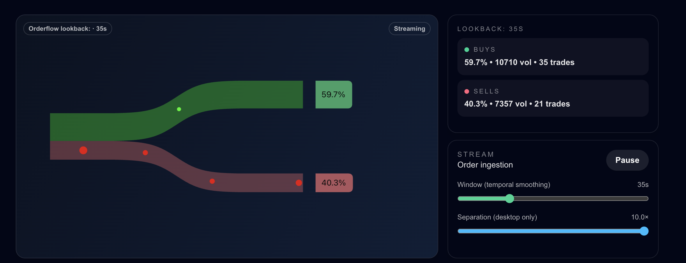

# Sankey Orderflow Visualization

Real-time, canvas-based orderflow bifurcation inspired by Sankey diagrams. The target audience is a trading UI where we communicate **market direction and buy/sell imbalance** through proportional flow and animated order activity. Challenge brief lives in `docs/PROBLEM_DOC.md`.



---

## Problem Brief

- Visualize live order flow with a left-to-right channel that splits into buy/sell branches; thickness reflects recent volume share.
- Orders animate across the channel, then curve into the destination branch; size reflects volume.
- Real-time updates; slider-based historic window is a nice-to-have.
- No charting libs; use raw canvas (or p5). RxJS stream helper is provided.

---

## X Stack Alignment (team preference)

- Bun + TypeScript + React shell for fast HMR and small footprint.
- **RxJS** to model the live order stream (pause/resume, backpressure, fan-out to canvas + aggregations).
- Raw `<canvas>` (p5-friendly) for rendering; no charting libs.
- Tailwind v4 for light styling around controls/overlays.
- Animation loop via `requestAnimationFrame`, detached from React renders.

---

## Architecture Outline

- **React shell**: wraps controls (pause/resume, window slider, desktop separation slider) and hosts the canvas element.
- **RxJS stream**: adapts the provided helper to emit synthetic orders; pause/resume; rolling aggregation happens in-memory with EMA smoothing.
- **Canvas layer**: owns the render loop, ribbon geometry/easing, particle pool, and inline stats chips; reads stream state via refs to avoid re-renders.

---

## Behavior & Interactions

- **Flow model**: Stacked origin on the left encodes buy/sell proportions; ribbons fan out horizontally via a sigmoid over the middle span, then run parallel. Width is conserved.
- **Order particles**: Each order animates along the ribbon centerline; radius uses a log scale on volume; particle colors differ from ribbon fills.
- **Temporal window**: Rolling aggregation window (slider-driven) smooths the buy/sell proportions with an EMA to reduce jitter.
- **Sankey feel**: Glued first quarter, eased fan-out mid-span, steady separation in the last quarter; desktop separation slider scales the gap.
- **Horizontal Sankey**: Origin is a vertical pillar (aggregate volume); buy/sell proportions are stacked segments; separation translates the boundary while heights carry proportion.
- **Separation of concerns**:
  - React hosts controls + canvas container and separation slider (desktop).
  - RxJS stream/hook ingests synthetic orders; rolling aggregates computed in-memory with smoothing.
  - Canvas layer owns ribbon geometry/easing, particle pool, and inline stats chips via refs.
- **Performance**: Particle pool and capped concurrency to keep GC and CPU in check; ribbon sampling tuned (80 samples) for smooth edges; responsive padding for mobile vs desktop.
- **Readability**: Percent-only pills live on the ribbons; volume/trade counts live in the stats panel; padding and separation controls avoid crowding on smaller screens.

---

## Data + Streaming Plan

- Start with the provided `useOrderStream` helper from the problem statement (BehaviorSubject/Subject-based) to synthesize realistic traffic; keep this as the default mode for demos.
- Normalize events into `OrderEvent` `{ id, side, volume, timestamp }` (extend as needed for animation state internally).
- Rolling aggregates: in-memory queue with window cutoff; EMA smoothing on share to avoid jitter. Widening the window uses retained orders only (no backfill yet).
- Controls: pause/resume stream, tweak time window, desktop separation slider; optionally add slow-mo for demos.
- Live Hyperliquid mode: subscribe to `trades` via `wss://api.hyperliquid.xyz/ws` for `BTC`, normalize side (buy/sell), compute notional volume (`size * price`), drop dupes by trade id, and feed the same pipeline as synthetic.
- Animation flow: each trade queues into the rolling window, increments per-side volume/count, spawns a particle (radius ~ log(volume)), updates smoothed share, and the canvas loop renders ribbons (proportional thickness) plus particles moving along the ribbon centerlines.
- Modes and controls at a glance: Synthetic (RxJS demo) vs Live Hyperliquid trades; pause/resume; lookback slider (drives window + EMA); desktop separation slider for gap; canvas pills show only %, while Stats Panel shows notional volume and trade counts.
- Window behavior: trades are deduped by id; window change triggers a full recalc of totals (no historic backfill); padding and separation tuned for desktop/mobile.
- Pause behavior: the toggle unsubscribes live and halts the synthetic stream; the canvas loop keeps running but the rolling window continues to age out trades, so shares decay as the window empties.
- Mode switching: flipping Synthetic ↔ Live only changes future arrivals. Existing trades stay in the window until they age out, so shares reflect a mix until the old trades expire (no automatic flush).

---

## Canvas Implementation Notes

- Ribbons are sampled edge paths with separation eased via a normalized sigmoid over the mid-span, then held steady.
- Maintain a small particle pool; particles follow ribbon centerlines with eased motion.
- Draw ribbons and particles separately so proportions stay readable even when few particles are on screen.
- Responsive padding to avoid crowding on mobile; separation scaling available on desktop.

---

## Testing with Live Data (after basics)

- Swap the synthetic stream for Hyperliquid trades once the canvas/aggregation loop is stable. Use the `trades` WebSocket subscription documented at <https://hyperliquid.gitbook.io/hyperliquid-docs/for-developers/api/websocket/subscriptions>; map trade events to `OrderEvent` and feed the same RxJS pipeline.
- Keep the synthetic generator as a fallback and for deterministic demo scenarios.

---

## Repo Map

- `app/page.tsx`: Orderflow experience (canvas, controls, stats).
- `components/orderflow/*`: Canvas, controls, stats UI.
- `lib/orderflow/*`: Order types, synthetic stream hook (RxJS).
- `next.config.ts`: Turbopack root pin.
- Legacy (create-next-app scaffolding): `src/*`, `build.ts` (if retained).

---

## Running Locally

```bash
# install
bun install    # or npm install

# dev with HMR
bun dev        # or npm run dev

# build
bun run build.ts
```

---

## Next Steps

- Swap synthetic stream for Hyperliquid trades via WebSocket subscription once the canvas/aggregation loop is solid.
- Add tests around the RxJS pipeline (aggregation correctness, pause/resume, backpressure under bursty input).
- Tune easing/curves and add presets for demo vs live-data modes.
